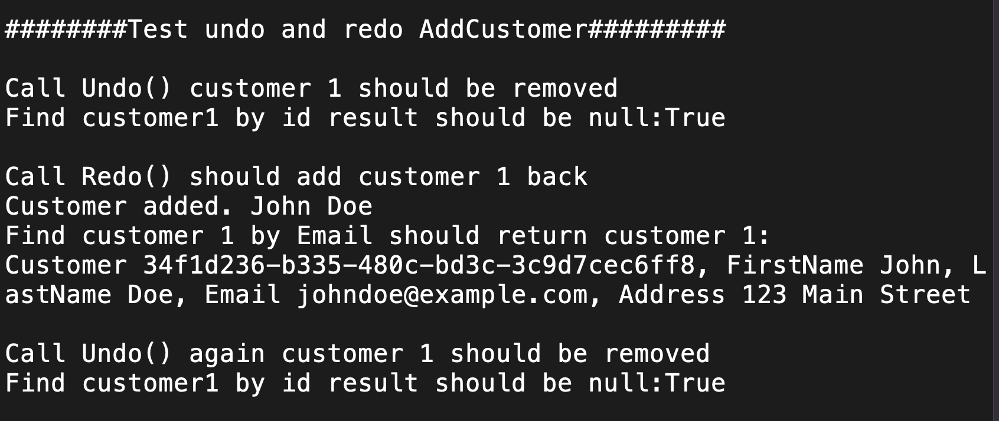

# Overview

This is a simple customer database management system that allows users to add, update, delete, and search for customers using various criteria. 

The application is designed to handle large amounts of data efficiently,so it utilizes the following appropriate structures and algorithms.

- Read and write csv file asynchronously
- Use LINQ to query data
- Use HashSet to store email
- Use Stack to store undo/redo actions

# Getting Started

To run the app, first clone the code to your local repo.
```bash
git clone your-fork-repo-url
```

Then, navigate to the project directory and run the following command to run the project.
```bash 
dotnet run 
```

I have added tests and demos in the Program.cs file. You can see the results in your terminal.





Data in `customers.csv` file is used populate the database. You can add more data to the file if you want to test the application with more data.

# Features

- Add a new customer
- Update an existing customer
- Delete a customer
- Search for a customer by ID
- Search for a customer by email
- Undo the last action
- Redo the last undone action
- Read and write data to a csv file asynchronously
- Custom exception handler to handle errors that may occur during the execution of the application
- Simple Console interface to provide feedback to the user

# Key design decisions
- User email is unique. When adding or updating a user, I ensure that no user has the same email.
- I created a Command class to capsulate the actions that can be undone and redone.
- DTOs are used to customize propertities that are exposed to the user.

